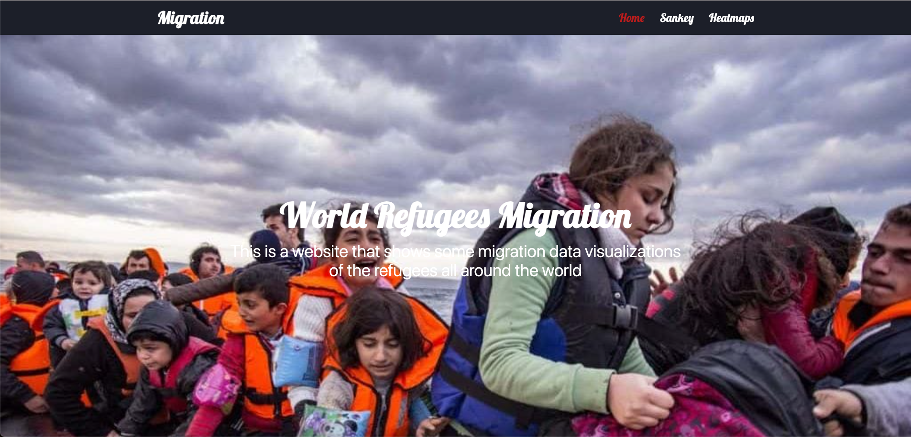
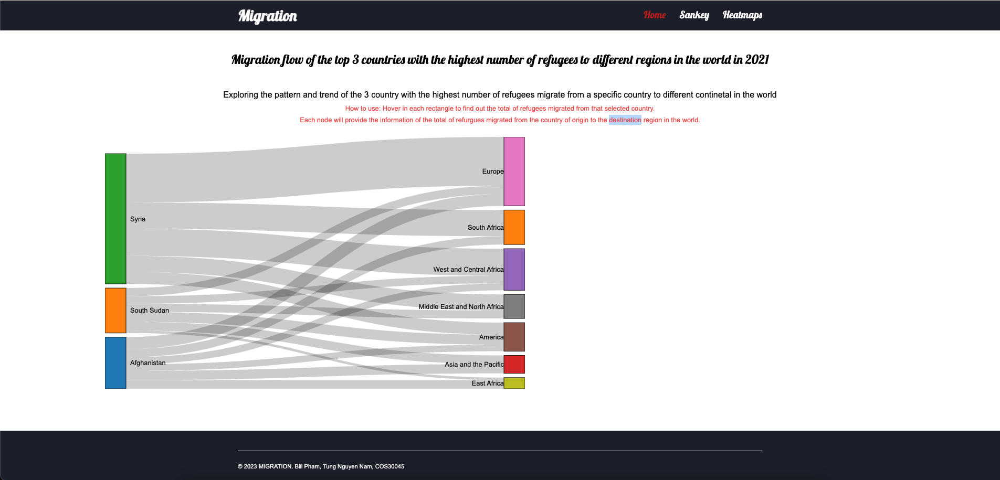
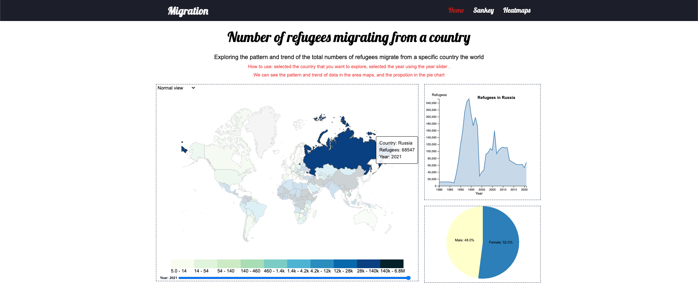

# Front end coding web application with HTML5, Tailwinds and D3.js chart





---

this is a repository for a front end based web application implementing HTML5, Tailwinds and D3.js chart

feature:

* Tailwild styling web application
* Sandkey map created using D3.js
* Reading json data type and data intergity checking
* Selected country on heatmap
* Extract and present different data respective to different usage and purpose of different map
* Slide feature with data changing respectively


access to the web application: 

```
https://datavisualization-github-io.vercel.app/src/home.html
```

---

# Clone the repository

```
git clone https://github.com/bbi3mn4u69/COS30045-Data_Visualisation.git

```

---

# Install package

```
npm i
```

---
# contribution thanks to @nguyen_nam_tung; @pham_nguyen_quang_huy